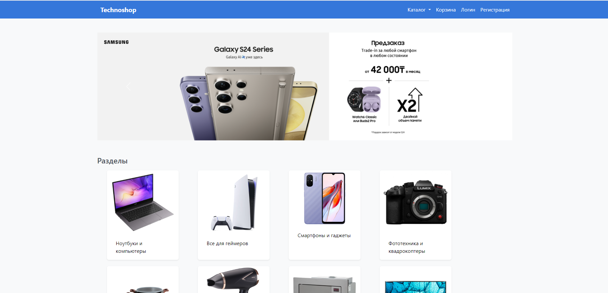
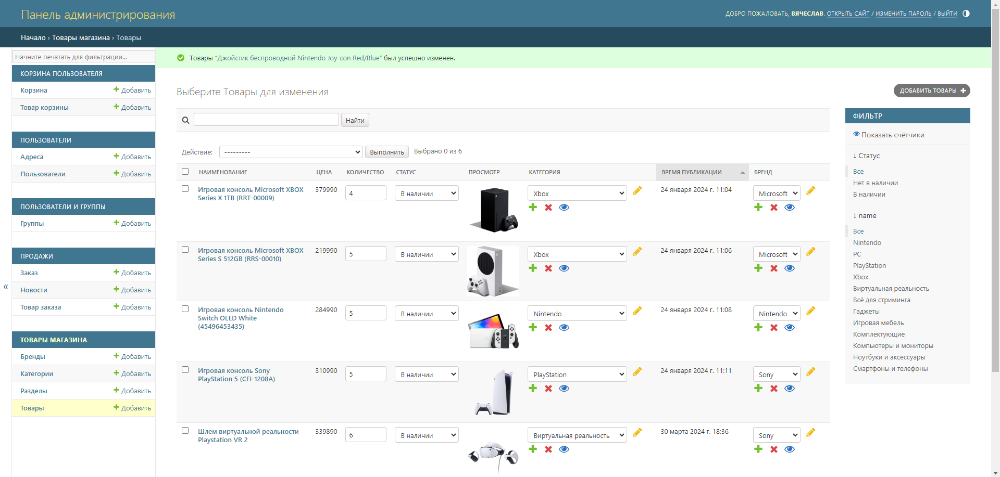
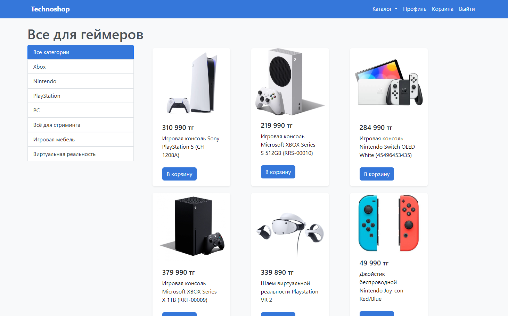
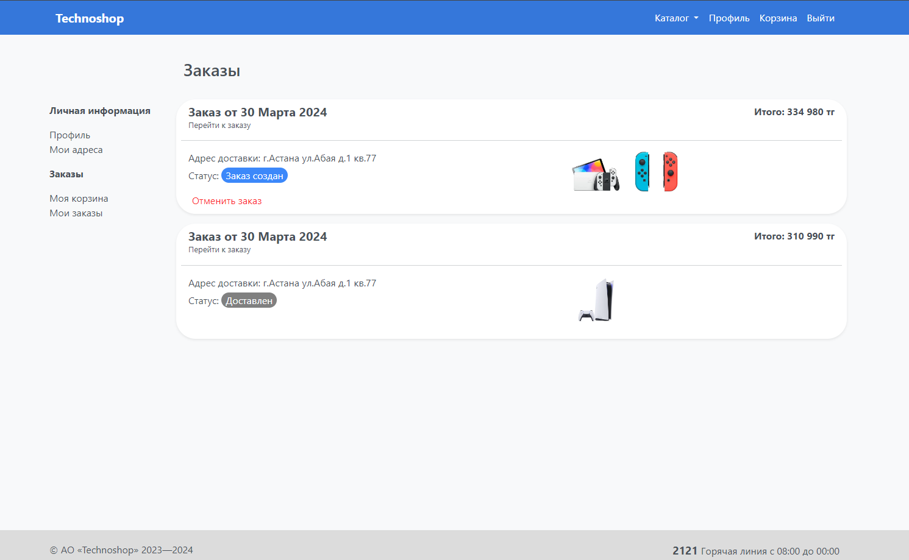

# Technoshop
Pet project for an online store of electronic equipment.

## Description

In this online store, you can browse through different sections, view products, add them to your cart, and make purchases. Additionally, there's a user-friendly admin panel that allows you to effortlessly add new sections and products to the website.

<b>Home page</b>


<b>Admin page</b>


<b>Items page</b>


<b>Cart page</b>


<b>Orders page</b>



## Built with

* Django
* Postgres
* Bootstrap
* Docker

## Executing program

The first thing to do is to clone the repository:

```sh
$ git clone https://github.com/Cagey7/technoshop.git
$ cd technoshop
```
### Run with docker
Write your settings in .env.example and run command:
```sh
$ docker compose -f production.yml up
```
### Run locally
Create a virtual environment to install dependencies in and activate it:
```sh
$ python -m venv venv
$ .\venv\Scripts\activate
```
Then install the dependencies:

```sh
(venv) $ pip install -r .\requirements\local.txt
```
Then edit technoshop/settings/local.py with your database settings.

Migrate:
```sh
(venv) $ python manage.py migrate --settings=technoshop.settings.local
```

Run server:

```sh
(venv) $ python manage.py runserver --settings=technoshop.settings.local
```
